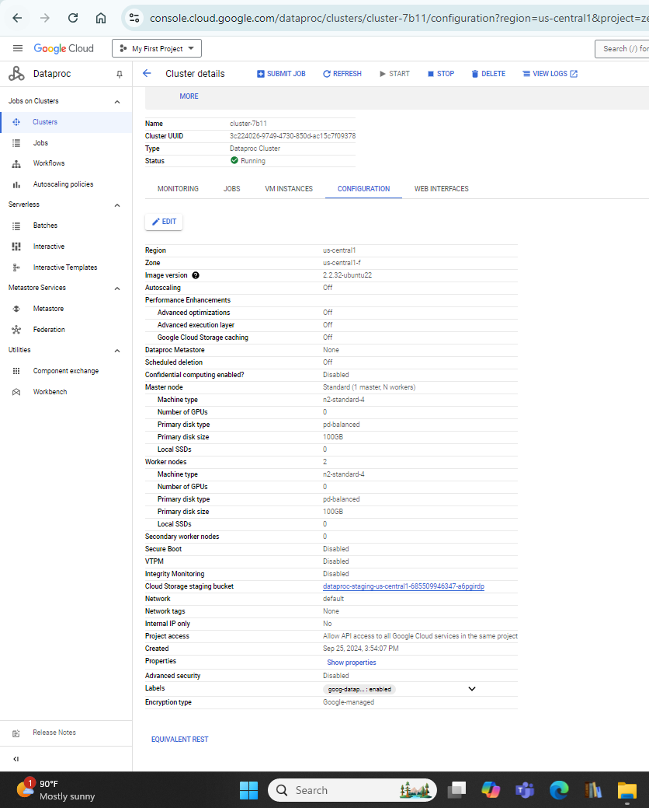
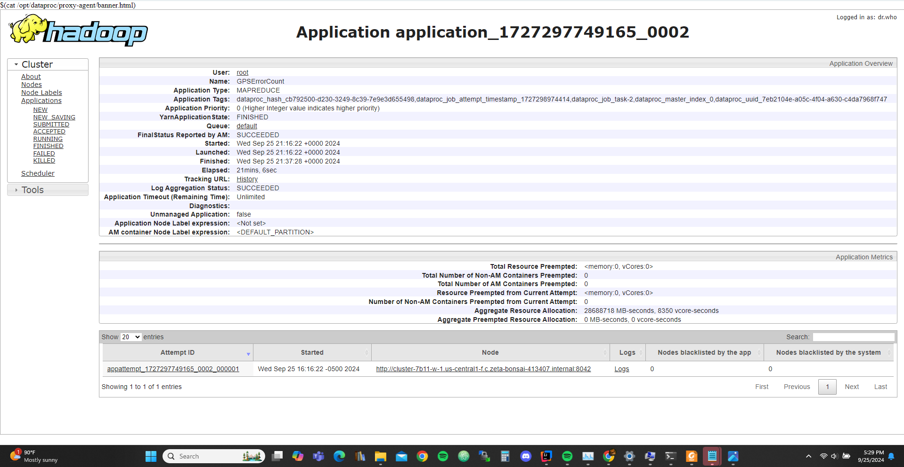
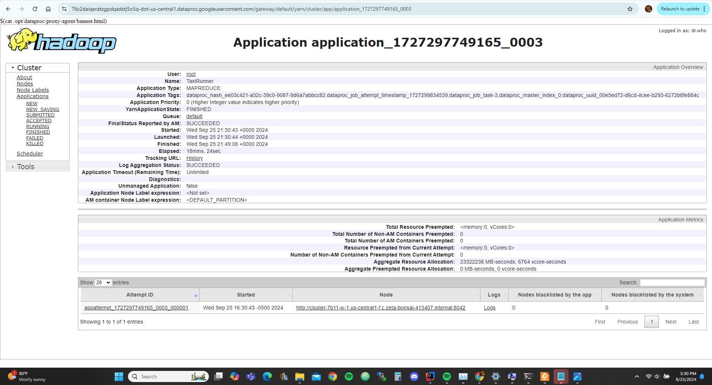

# Please add your team members' names here. 

## Team members' names 

1. Student Name: Jacob Dittoe  
   Student UT EID: jmd6542
2. Student Name: Sam Wang  
   Student UT EID: scw2469
3. Student Name: Ashton Mehta  
   Student UT EID: anm4883
4. Student Name: Nathan Cheng  
   Student UT EID: nyc278

 ...

##  Course Name: CS378 - Cloud Computing 

##  Unique Number: 51515
    


# Add your Project REPORT HERE 

## - Configuration


## - Machines on Cluster


## - Result folder and jar files


## - Jobs Ran


## - Task 1


```
1   176113
2   135791
3   105692
4   81900
5   66481
6   121014
7   197056
8   237868
9   248310
10  241876
11  248226
12  264040
13  263512
14  276763
15  275919
16  243519
17  272288
18  331075
19  344939
20  323571
21  319305
22  309237
23  276934
24  227452

```


## - Task 2

### - TopK for Task 2


```
FF96A951C04FBCEDE5BCB473CF5CBDBF	1.0
02510B3B0E797E51AF73361185F62D0B	1.0
022B8DF4D6D7C4DCF11233DD74C9E189	1.0
0219EB9A4C74AAA118104359E5A5914C	1.0
00DC83118CA675B9A2876C35E3398AF5	1.0
```

## - Task 3

### - TopK for Task 3


```
FD2AE1C5F9F5FBE73A6D6D3D33270571	4094.9998
A7C9E60EEE31E4ADC387392D37CD06B8	1260.0
D8E90D724DBD98495C1F41D125ED029A	630.0
E9DA1D289A7E321CC179C51C0C526A73	231.29999
95A921A9908727D4DC03B5D25A4B0F62	210.0
74071A673307CA7459BCF75FBD024E09	209.99998
42AB6BEE456B102C1CF8D9D8E71E845A	191.55
28EAF0C54680C6998F0F2196F2DA2E21	179.99998
FA587EC2731AAB9F2952622E89088D4B	179.99998
E79402C516CEF1A6BB6F526A142597D4	144.54546
```


# Project Template

# Running on Laptop     ####

Prerequisite:

- Maven 3

- JDK 1.6 or higher

- (If working with eclipse) Eclipse with m2eclipse plugin installed


The java main class is:

edu.cs.utexas.task1.GPSErrorCount 

Input file:  Book-Tiny.txt  

Specify your own Output directory like 

# Running:


## Create a JAR Using Maven 

To compile the project and create a single jar file with all dependencies: 
	
```	mvn clean package ```


## Run your application
Inside your shell with Hadoop

Running as Java Application:

```java -jar target/task1.jar-jar-with-dependencies.jar taxi-data-sorted-small.csv output1```

```java -jar target/task2.jar-jar-with-dependencies.jar taxi-data-sorted-small.csv intermediate2 output2```

```java -jar target/task3.jar-jar-with-dependencies.jar taxi-data-sorted-small.csv intermediate3 output3```


## Create a single JAR File from eclipse


Create a single gar file with eclipse 

*  File export -> export  -> export as binary ->  "Extract generated libraries into generated JAR"
