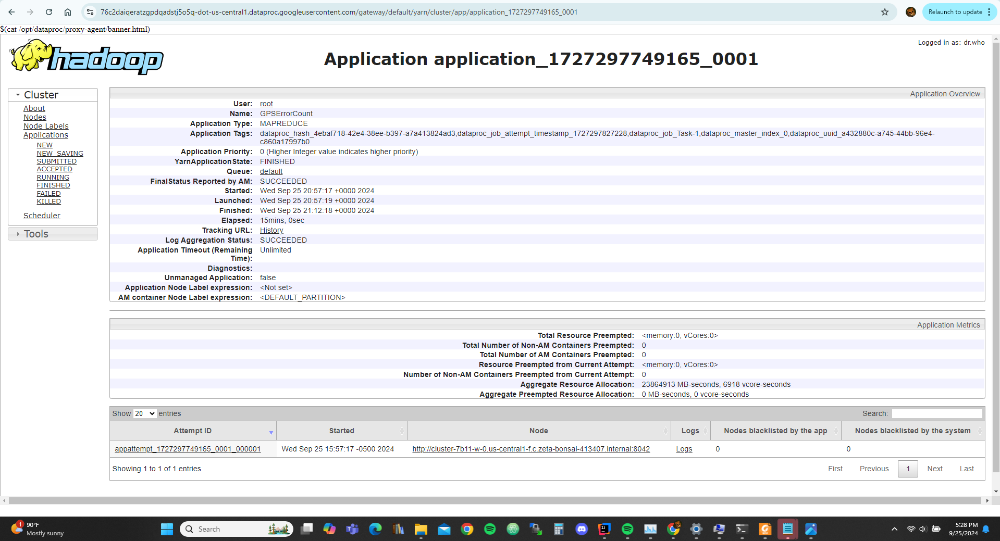

# Please add your team members' names here. 

## Team members' names 

1. Student Name: Jacob Dittoe  
   Student UT EID: jmd6542
2. Student Name: Sam Wang  
   Student UT EID: scw2469
3. Student Name: Ashton Mehta  
   Student UT EID: anm4883
4. Student Name: Nathan Cheng  
   Student UT EID: nyc278

 ...

##  Course Name: CS378 - Cloud Computing 

##  Unique Number: 51515
    


# Add your Project REPORT HERE 

## - Console


## - Result folder and jar files


## - Task 1


## - Task 2


## - Task 3


# Project Template

# Running on Laptop     ####

Prerequisite:

- Maven 3

- JDK 1.6 or higher

- (If working with eclipse) Eclipse with m2eclipse plugin installed


The java main class is:

edu.cs.utexas.task1.GPSErrorCount 

Input file:  Book-Tiny.txt  

Specify your own Output directory like 

# Running:


## Create a JAR Using Maven 

To compile the project and create a single jar file with all dependencies: 
	
```	mvn clean package ```


## Run your application
Inside your shell with Hadoop

Running as Java Application:

```java -jar target/task1.jar-jar-with-dependencies.jar taxi-data-sorted-small.csv output1```

```java -jar target/task2.jar-jar-with-dependencies.jar taxi-data-sorted-small.csv intermediate2 output2```

```java -jar target/task3.jar-jar-with-dependencies.jar taxi-data-sorted-small.csv intermediate3 output3```


## Create a single JAR File from eclipse


Create a single gar file with eclipse 

*  File export -> export  -> export as binary ->  "Extract generated libraries into generated JAR"
